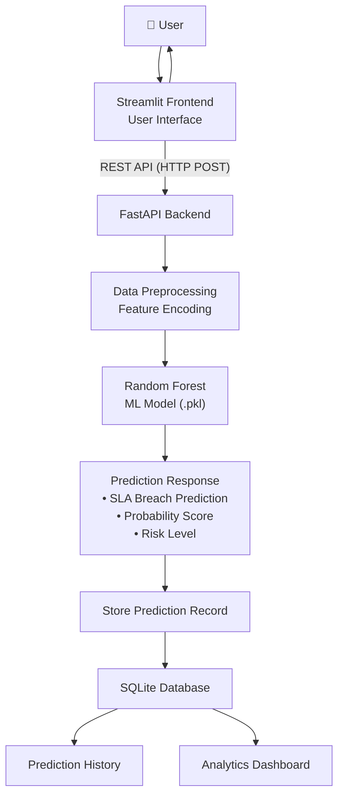

<p align="center">

</p>

# 🛠️ Intelligent ITSM Decision Support System

<p align="center">

<a href="https://itsm-decision-support.streamlit.app">

</a>

<a href="https://intelligent-itsm-api.onrender.com/docs">

</a>

<a href="https://github.com/TanmayJindal1205/Intelligent-ITSM-Decision-Support-System">

</a>

</p>

<p align="center">


</p>

## Executive Summary

The Intelligent ITSM Decision Support System is an enterprise-focused machine learning application that predicts Service Level Agreement (SLA) breach risk for newly created IT service tickets using real-world ITSM data from Jindal Stainless Limited (JSL). The system combines predictive analytics, operational recommendations, historical tracking, and interactive dashboards to support proactive IT service management.

The system combines:

- Machine Learning Prediction
- Streamlit Dashboard
- FastAPI REST API
- SQLite Persistence
- Interactive Analytics
- Automated Recommendations

to enable proactive SLA risk assessment and operational decision support.

## Project Highlights

- Real enterprise ITSM dataset (JSL)
- Six machine learning algorithms evaluated
- Production-ready Random Forest model
- 88.53% Accuracy
- ROC-AUC: 0.9060
- Streamlit + FastAPI architecture
- SQLite persistence
- Plotly analytics dashboard
- Excel export support
- SHAP explainability

> **Developed during a Summer Internship at Jindal Stainless Limited (JSL), Hisar using real enterprise ITSM ticket data.**

## Project Overview

The **Intelligent ITSM Decision Support System** is an end-to-end Machine Learning application designed to proactively identify IT service tickets that are likely to breach Service Level Agreements (SLAs).

Rather than reacting to SLA violations after they occur, the system predicts breach risk at ticket creation time, enabling proactive intervention and operational decision-making.

The application combines a trained Machine Learning model, an interactive Streamlit dashboard, a FastAPI backend, and SQLite-based persistence into a complete decision support system suitable for enterprise IT Service Management workflows.

---

## Dataset

This project was developed using **real-world enterprise IT Service Management (ITSM) ticket data** from **Jindal Stainless Limited (JSL), Hisar**.

The dataset contains historical IT service tickets and SLA outcomes collected from production IT operations. It includes ticket metadata such as:

- Priority
- Category
- Sub Category
- Department
- Group
- Site
- Request Type
- Created Day
- Created Month
- Created Hour

### Target Variable

- SLA Breach (Binary Classification)

> **Note:** The original dataset contains proprietary organizational information belonging to Jindal Stainless Limited (JSL) and is **not included** in this repository due to confidentiality and data privacy requirements.

The machine learning pipeline, application source code, trained model, and deployment components are included so the complete system architecture and implementation can be understood and reproduced.

### Industry Relevance

Service Level Agreement (SLA) violations can lead to operational delays, reduced customer satisfaction, and increased support costs.

This system enables IT support teams to proactively identify high-risk service tickets at creation time, allowing early intervention through prioritization, escalation, and resource allocation. By combining machine learning predictions with interactive analytics and operational recommendations, the application supports data-driven decision-making in enterprise IT Service Management environments.

## Application Preview

### Main Prediction Interface

<p align="center">
  
">
</p>

---

### Prediction Result

<p align="center">
  
">
</p>

---

### Prediction History

<p align="center">
  
">
</p>

---

### Analytics Dashboard

<p align="center">
  
">
</p>

 <p align="center">
  
</p>

<p align="center">
  
</p>

---

### REST API (Swagger)

<p align="center">
  
">
</p>

---

## Key Features

- Predict SLA breach risk for new IT service tickets
- Display breach probability with risk categorization
- Generate operational recommendations based on prediction results
- Maintain prediction history using SQLite
- Interactive analytics dashboard with Plotly visualizations
- Export prediction history to Excel
- REST API built with FastAPI
- Machine Learning inference using the best-performing model selected after evaluating multiple classification algorithms
- Model explainability using SHAP and feature importance analysis
- Modular project structure for maintainability

---

## Application Components

### 1. Ticket Prediction

Predicts whether a newly created IT service ticket is likely to breach its SLA using ticket attributes such as:

- Priority
- Category
- Sub Category
- Department
- Group
- Site
- Request Type
- Created Day
- Created Month
- Created Hour

The application returns:

- Prediction
- SLA Breach Probability
- Risk Level
- Operational Recommendations

---

### 2. Prediction History

Automatically stores every prediction inside a SQLite database and provides a searchable historical record of previous predictions.

---

### 3. Analytics Dashboard

The analytics module provides interactive visualizations including:

- Risk Distribution
- Department-wise Breach Analysis
- Category-wise Breach Analysis
- Site-wise Breach Analysis
- Monthly Ticket Trend
- Ticket Creation Hour Distribution
- High Risk Category Analysis

---

## Project Architecture



---

## Tech Stack

| Category | Technologies |
|-----------|--------------|
| Programming Language | Python |
| Machine Learning | Scikit-learn |
| Explainability | SHAP |
| Frontend | Streamlit |
| Backend API | FastAPI |
| Database | SQLite |
| Data Processing | Pandas, NumPy |
| Visualization | Plotly |
| Model Serialization | Joblib |
| Excel Export | OpenPyXL |

---

## Machine Learning Pipeline

The predictive model was developed using a complete supervised machine learning workflow to identify IT service tickets that are likely to breach their Service Level Agreements (SLAs).

### Workflow

```
Enterprise ITSM Dataset (JSL)
        │
        ▼
Data Cleaning & Preprocessing
        │
        ▼
Ordinal Encoding
        │
        ▼
SMOTENC (Class Imbalance Handling)
        │
        ▼
Stratified Train-Test Split
        │
        ▼
Model Training
        │
        ▼
Cross Validation
        │
        ▼
GridSearchCV Hyperparameter Tuning
        │
        ▼
Model Evaluation
        │
        ▼
Random Forest Selection
        │
        ▼
Deployment
```

---

## Model Development

The following machine learning algorithms were trained and evaluated during experimentation:

- Logistic Regression
- Decision Tree
- Random Forest
- XGBoost
- LightGBM
- CatBoost

After comparative evaluation and hyperparameter tuning, the Random Forest Classifier was selected as the final production model based on its overall performance and robustness.

The finalized model was serialized using Joblib and integrated into both the Streamlit application and the FastAPI backend for real-time inference.

---

## Model Performance

| Metric | Score |
|---------|------:|
| Accuracy | **88.53%** |
| Precision | **65.54%** |
| Recall | **68.01%** |
| F1-Score | **66.75%** |
| ROC-AUC | **0.9060** |
| Average Precision | **0.7327** |

The Random Forest classifier delivered the strongest overall performance among all evaluated models and was selected for deployment. Its balanced precision, recall, F1-score, and ROC-AUC demonstrate robust predictive capability for enterprise SLA breach classification. The trained model was serialized using Joblib and integrated into both the Streamlit application and the FastAPI backend for real-time inference.

---

## Data Preprocessing & Model Development

The machine learning pipeline incorporates multiple preprocessing and model development steps, including:

- Missing value handling
- Duplicate record removal
- Ordinal encoding of categorical features
- SMOTENC-based class imbalance handling
- Stratified train-test splitting
- Cross-validation
- GridSearchCV hyperparameter tuning
- Feature importance analysis
- SHAP-based model explainability

---

## Prediction Output

For every newly created IT service ticket, the system generates:

- SLA Breach Prediction
- Breach Probability (%)
- Risk Level (LOW / MEDIUM / HIGH)
- Operational Recommendations

These outputs are stored in a SQLite database and are available for historical analysis and dashboard visualizations.

---

## Project Structure

```text
Intelligent-ITSM-Decision-Support-System
│
├── api/                         # FastAPI backend
│   └── main.py
│
├── assets/                      # CSS styling and static assets
│   └── style.css
│
├── components/                  # Reusable Streamlit components
│   ├── cards.py
│   ├── prediction.py
│   ├── recommendations.py
│   └── ui.py
│
├── database/                    # SQLite database
│   ├── database.py
│   └── predictions.db
│
├── docs/                        # Documentation and screenshots
│
├── model/                       # Trained ML model
│   ├── final_model.pkl
│   └── metadata.json
│
├── notebooks/                   # Model development notebook
│   └── ITSM_Model_Training_Pipeline.ipynb
│
├── pages/                       # Additional Streamlit pages
│   ├── Prediction_History.py
│   └── Analytics_Dashboard.py
│
├── tests/                       # Test scripts
│
├── .streamlit/
│
├── app.py                       # Main Streamlit application
├── requirements.txt
├── LICENSE
├── README.md
└── .gitignore
```

---

## ⚙️ Installation

### 1. **Clone the Repository**

```bash
git clone https://github.com/TanmayJindal1205/Intelligent-ITSM-Decision-Support-System.git

cd Intelligent-ITSM-Decision-Support-System
```

---

### 2. **Create a Virtual Environment**

#### **Windows**

```bash
python -m venv .venv

.venv\Scripts\activate
```

#### **macOS / Linux**

```bash
python3 -m venv .venv

source .venv/bin/activate
```

---

### 3. **Install Dependencies**

```bash
pip install -r requirements.txt
```

---

### 4. **Run the Streamlit Application**

```bash
streamlit run app.py
```

The application will open at:

```
http://localhost:8501
```

---

### 5. **Run the FastAPI Backend**

```bash
uvicorn api.main:app --reload
```

The API documentation is available at:

```
http://127.0.0.1:8000/docs
```

---

## REST API

The project exposes a RESTful API built using **FastAPI**, allowing external applications to integrate the trained SLA breach prediction model without using the Streamlit interface.

### Available Endpoint

### Predict SLA Breach

**POST** `/predict`

#### Request

```json
{
  "priority": "High",
  "category": "Software",
  "sub_category": "Application",
  "department": "IT",
  "group": "Infrastructure",
  "site": "Head Office",
  "request_type": "Incident",
  "created_day": "Monday",
  "created_month": "January",
  "created_hour": 14
}
```

#### Response

```json
{
  "prediction": "Breach",
  "probability": 0.91,
  "risk_level": "HIGH",
  "recommendation": "Immediate escalation recommended."
}
```

---

Interactive Swagger documentation is available after starting the API:

```
http://127.0.0.1:8000/docs
```

---

## Future Enhancements

Although the current application is fully functional, several enhancements can further improve its capabilities:

- User Authentication & Role-Based Access Control
- Cloud Database Integration (PostgreSQL)
- Docker Containerization
- CI/CD Pipeline with GitHub Actions
- Kubernetes Deployment
- Real-Time Ticket Monitoring
- Explainable AI Dashboard
- Automated Model Retraining
- Email & Slack Alert Integration
- Multi-model Ensemble Prediction
- Cloud Deployment with Auto Scaling

---

## Deployment

The application is deployed as:

- Streamlit Cloud (Frontend)
- Render (FastAPI Backend)

### Live Application

- Streamlit Frontend: [https://itsm-decision-support.streamlit.app](https://itsm-decision-support.streamlit.app/)
- FastAPI Swagger: [https://intelligent-itsm-api.onrender.com/docs](https://intelligent-itsm-api.onrender.com/docs)

## Results

The deployed system successfully integrates machine learning with enterprise ITSM workflows by providing:

- Real-time SLA breach prediction
- Probability-based risk assessment
- Automated operational recommendations
- Persistent prediction history
- Interactive analytics dashboard
- REST API for external integration

The application enables proactive identification of high-risk service tickets, helping IT teams prioritize critical incidents before SLA violations occur.

## License

This project is licensed under the MIT License.

For more information, see the [LICENSE](LICENSE) file.

## Author

**Tanmay Jindal**

Computer Science Enginerring Undergraduate

Netaji Subhas University of Technology (NSUT)

GitHub: **https://github.com/TanmayJindal1205**

If you found this project useful, consider giving it a ⭐ on GitHub.
